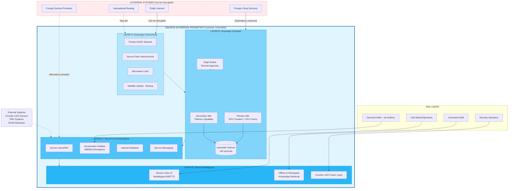
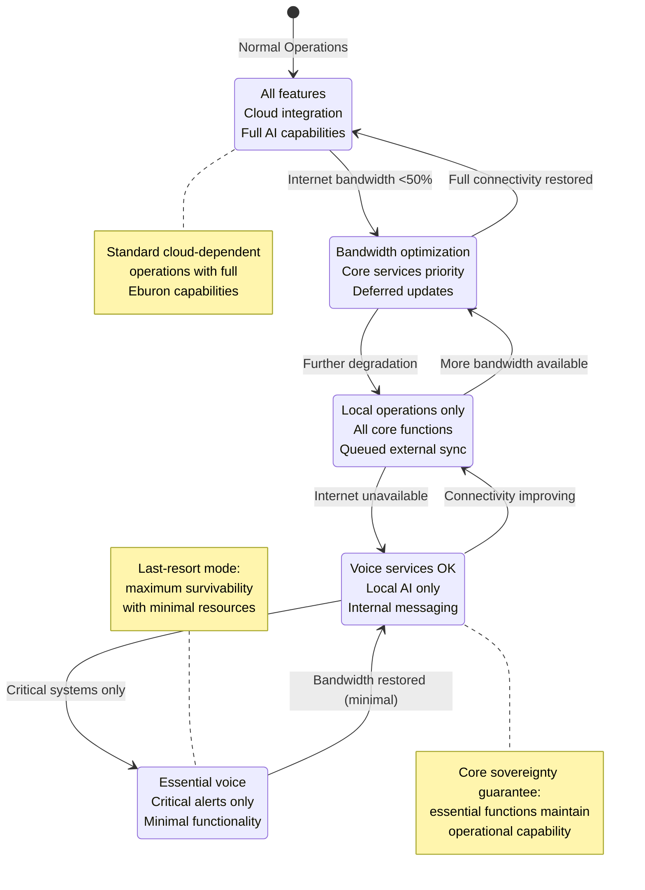
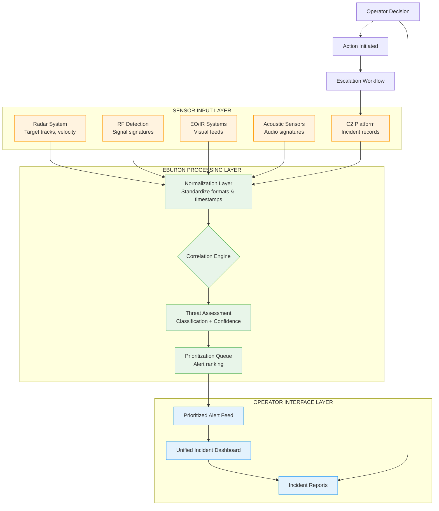
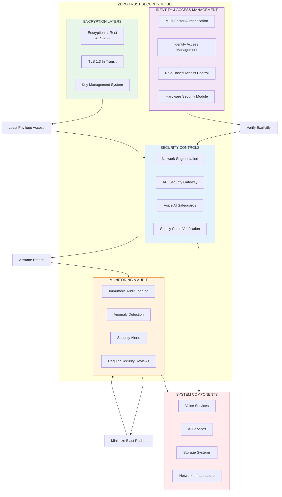
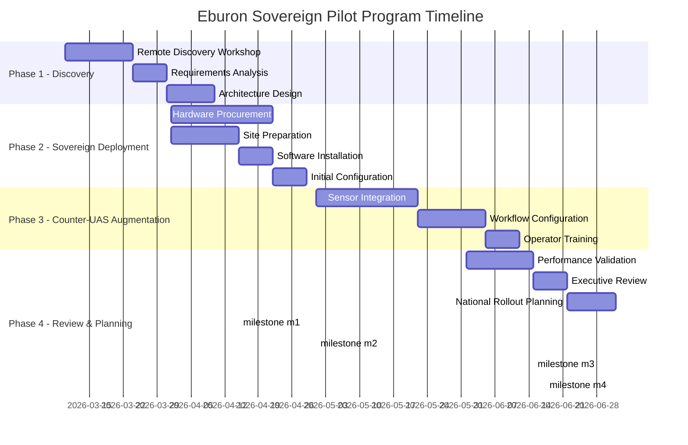

# ARCHITECTURE DIAGRAMS: Eburon Sovereign Platform

## Overview of Diagrams Included

1. **High-Level Architecture** - Four-layer sovereign architecture overview
2. **Continuity Mode Behavior** - System behavior during internet disruption scenarios
3. **Counter-UAS Integration** - Sensor fusion and operator workflow
4. **Deployment Topology** - Multi-site deployment with failover
5. **Voice Intelligence Pipeline** - Real-time voice processing flow
6. **Security Architecture** - Zero Trust security model implementation

---

## Diagram 1: High-Level Sovereign Architecture



---

## Diagram 2: Continuity Mode Behavior



---

## Diagram 3: Counter-UAS Sensor Fusion Workflow



---

## Diagram 4: Multi-Site Deployment Topology

```mermaid
graph TB
    subgraph SITE_A["PRIMARY SITE - Location A"]
        direction TB
        COMPUTE_A[Compute Cluster<br/>GPU + CPU]
        STORAGE_A[Primary Storage<br/>Local SSD + SAN]
        NETWORK_A[Site Network<br/>Management + Production]

        VOICE_SERVICES_A[Voice Services]
        AI_SERVICES_A[AI Inference Services]
        DB_A[Database Primary]
    end

    subgraph SITE_B["SECONDARY SITE - Location B"]
        direction TB
        COMPUTE_B[Compute Cluster<br/>GPU + CPU (Standby)]
        STORAGE_B[Replicated Storage]
        NETWORK_B[Site Network]

        VOICE_SERVICES_B[Voice Services]
        AI_SERVICES_B[AI Inference Services]
        DB_B[Database Replica]
    end

    subgraph EDGE["EDGE NODES - Distributed"]
        EDGE_1[Edge Node 1<br/>Remote Agency A]
        EDGE_2[Edge Node 2<br/>Remote Agency B]
        EDGE_3[Edge Node 3<br/>Strategic Site]
    end

    %% Inter-site connectivity
    SITE_A <--Fiber Interconnect--> SITE_B

    %% Failover relationship
    FAILOVER[(Failover System)]
    SITE_A --> FAILOVER
    SITE_B --> FAILOVER

    %% Edge connections
    EDGE_1 <-->|Store-and-forward| SITE_A
    EDGE_2 <-->|Store-and-forward| SITE_A
    EDGE_3 <-->|Store-and-forward| SITE_B

    %% External connectivity (optional, for normal operations)
    INTERNET[Public Internet] -.-> SITE_A
    EXTERNAL_API[External APIs] -.-> SITE_A

    classDef primary fill:#c8e6c9,stroke:#2e7d32
    classDef secondary fill:#fff9c4,stroke:#fbc02d
    classDef edge fill:#ffccbc,stroke:#d84315

    class SITE_A primary
    class SITE_B secondary
    class EDGE_1,EDGE_2,EDGE_3 edge
```

---

## Diagram 5: Voice Intelligence Pipeline

```mermaid
flowchart LR
    subgraph INPUT["AUDIO INPUT"]
        CALL[Incoming Call]
        RECORDING[Recorded Audio]
    end

    subgraph ASR["SPEECH RECOGNITION"]
        PREPROCESS[Preprocessing<br/>Noise Suppression]
        STT[Speech-to-Text<br/>Continuous Transcription]
        DIARIZE[Speaker Diarization]
    end

    subgraph NLP["LANGUAGE PROCESSING"]
        INTENT[Intent Classification]
        ENTITY[Entity Extraction]
        CONTEXT[Context Analysis]
        RETRIEVE[Knowledge Retrieval]
    end

    subgraph RESPONSE["RESPONSE GENERATION"]
        SUGGEST[Response Suggestions]
        ACTION[Action Item Creation]
        TTS_TEXT[TTS-Ready Text]
    end

    subgraph OUTPUT["OUTPUT"]
        DISPLAY[Operator Display]
        SPEECH[Text-to-Speech]
        TICKET[Ticket Creation]
        LOG[Audit Log]
    end

    %% Flow
    CALL --> PREPROCESS
    RECORDING --> PREPROCESS
    PREPROCESS --> STT
    STT --> DIARIZE

    DIARIZE --> INTENT
    INTENT --> ENTITY
    ENTITY --> CONTEXT
    CONTEXT --> RETRIEVE

    RETRIEVE --> SUGGEST
    SUGGEST --> ACTION
    ACTION --> TTS_TEXT

    TTS_TEXT --> DISPLAY
    TTS_TEXT --> SPEECH
    ACTION --> TICKET
    ACTION --> LOG

    classDef input fill:#fce4ec,stroke:#e91e63
    classDef asr fill:#e1bee7,stroke:#9c27b0
    classDef nlp fill:#e8eaf6,stroke:#3f51b5
    classDef response fill:#c8e6c9,stroke:#4caf50
    classDef output fill:#b2dfdb,stroke:#009688

    class CALL,RECORDING input
    class PREPROCESS,STT,DIARIZE asr
    class INTENT,ENTITY,CONTEXT,RETRIEVE nlp
    class SUGGEST,ACTION,TTS_TEXT response
    class DISPLAY,SPEECH,TICKET,LOG output
```



---

## Diagram 6: Security Architecture (Zero Trust)



---

## Diagram 7: Pilot Program Implementation Timeline



---

## Diagram Usage Notes

All diagrams are provided in Mermaid format and can be:
- Rendered directly in Markdown viewers that support Mermaid
- Converted to SVG/PNG using tools like `mermaid-cli`
- Embedded in documentation systems
- Used as reference for implementation planning

The diagrams emphasize:
1. **Sovereignty boundaries** - Clear distinction between external dependencies and controlled perimeter
2. **Graceful degradation** - How systems behave during disruption scenarios
3. **Human-in-command** - Operator decision authority maintained throughout
4. **Zero Trust security** - Verification at every layer with least privilege access
